# Práctica 3 de Gestión/Almacenamiento de información no estructurada

## Nombre del alumno: Juan José Olmedilla Arregui

### 1. (1 punto) Creación de la base de datos

He elegido desplegar el sistema como un contenedor docker en mi máquina local y conectarme a ella mediante el neo4j 
browser que viene con el mismo, accesible por HTTP en el puerto 7474 con un navegador web. Desde dicho browser he pegado el contenido de fichero
grafos.txt y lo he ejecutado como se muestra en la imagen a continuación.

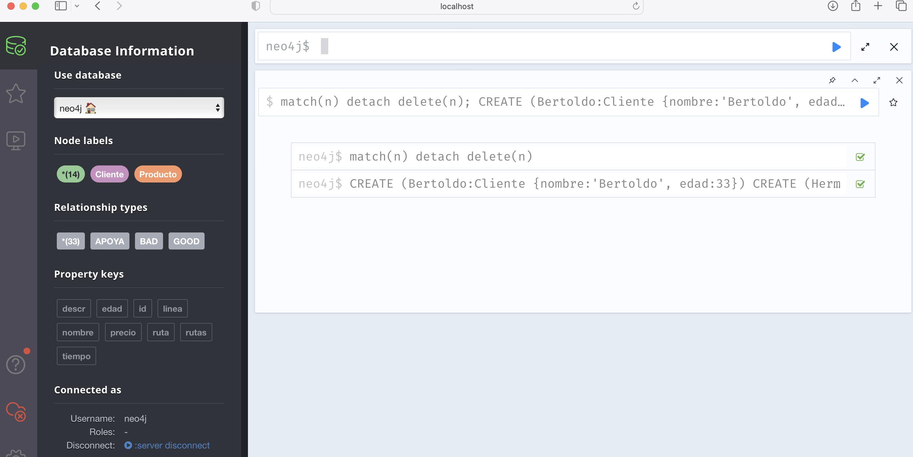

Como resultado de la carga se puede observar a continuación el grafo resultante mostrado en neo4j browser-

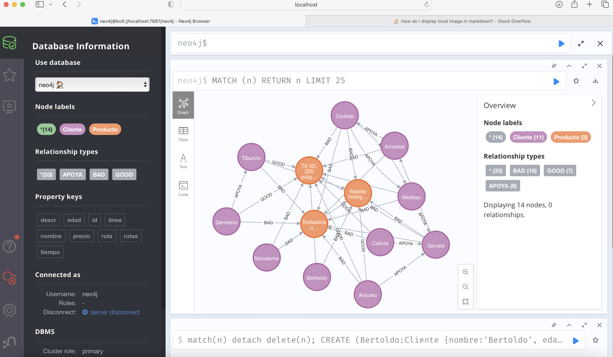

### 2. Consultas sobre la base de datos de productos y clientes

Todas las consultas comentadas en este apartado se encuentran en el fichero `consultas-productos-clientes.cyp`

#### 1.1. (1 punto) Nombre clientes que han dado buenas opiniones sobre el producto cuyo precio es 4.000 €

Esta consulta es bastante sencilla. Seguimos el consejo de poner los nodos anónimos, sin variable al final de
la cláusula `MATCH`

```cypher
MATCH (c:Cliente)-[:GOOD]->(:Producto {precio:4000}) 
RETURN c.nombre AS `Nombre`
```
El resultado es el siguiente:

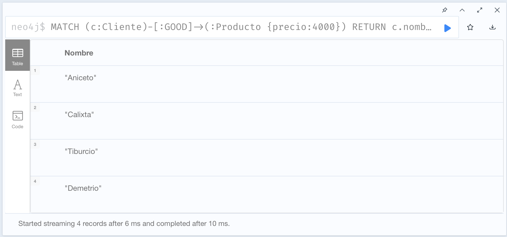

#### 1.2. (1 punto) Clientes que formen un "circuito" de relaciones de tipo "APOYA, es decir  una secuencia de 
relaciones, todas en la misma dirección, que acaba y empieza en el mismo Cliente.

Se nos pide en el enunciado que utilicemos como base de esta consulta el resultado del apartado anterior. He 
interpretado que se pide pues utilizar los nodos resultantes del apartado anterior para encontrar circuitos que
empiecen y acaben en dichos nodos.

**Primero crearemos la consulta sin tener en cuenta los resultados
de la consulta anterior**:

```cypher
MATCH path=(c:Cliente)-[:APOYA*]->(c:Cliente) 
RETURN nodes(path)
```

Da como resultado este sub-grafo:

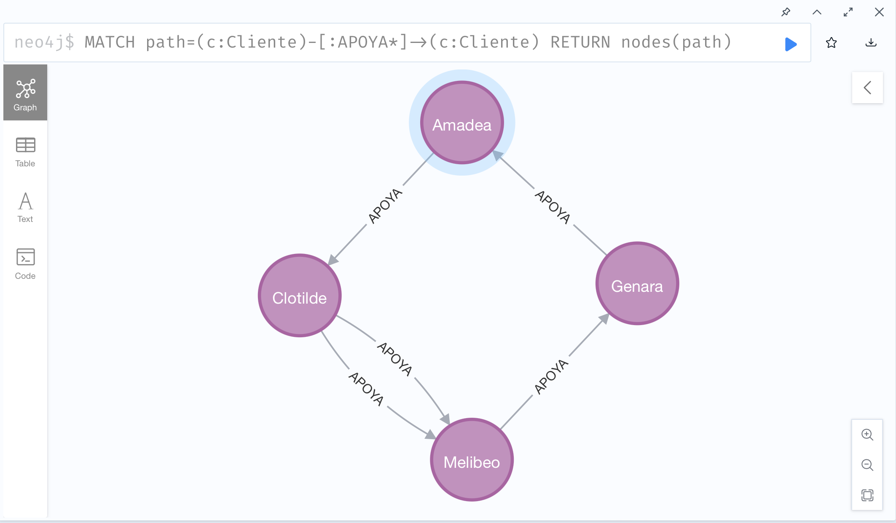

**A continuación construiremos la consulta partiendo del resultado de la consulta del apartado anterior:**

```cypher
MATCH (c:Cliente)-[:GOOD]->(:Producto {precio:4000})
WITH c
MATCH path=(c:Cliente)-[:APOYA*]->(c:Cliente) 
RETURN nodes(path)
```

Nótese que utilizamos la cláusula WITH permite arrastrar el resultado de una cláusula `MATCH` como entrada de la 
siguiente, además tenemos que indicar qué variables definidas en la cláusula _nos llevamos_ a la siguiente. En este caso
nos bastaba con arrastra la variable `c` que es la única que hemos definido y dado valor en el primer `MATCH`. Como
podemos observar el la imagen la ejecución nos dice que no hay ningún circuito de relaciones "APOYA" que empiece y acabe
en ninguno de los nodos que habíamos obtenido con anterioridad.

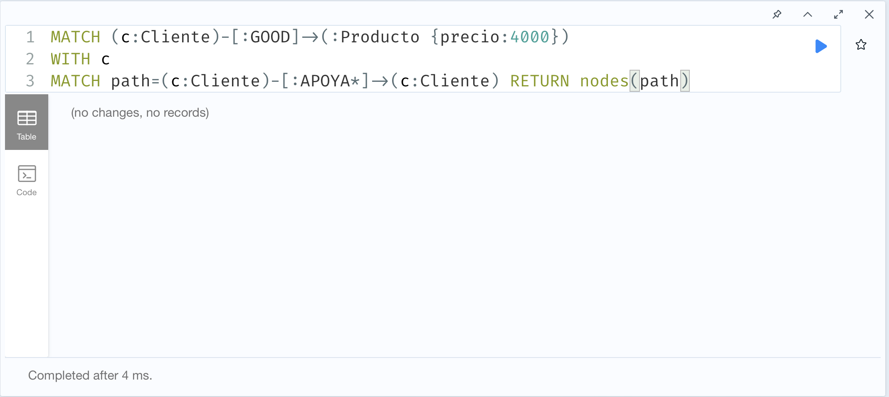

#### 1.3. (1 punto) Creación de relación APOYA entre Demetrio y Genara

Se pide crear dicha relación sin suponer que existen ni dichos nodos ni dicha relación y evitando que se creen duplicados
en caso de existir cualquiera de ellos. Precisamente para ese fin existe la cláusula `MERGE` pero hay que tener en cuenta
que si creamos un único `MERGE` con todo el camino de un nodo al otro podemos crear duplicados de los nodos aunque evitemos
duplicar la relación. Por tanto dividimos la cláusula en tres `MERGE` más pequeños de la siguiente manera:

```cypher
MERGE (d:Cliente{nombre:"Demetrio"}) 
MERGE (g:Cliente {nombre:"Genara"}) 
MERGE (d)-[:APOYA]->(g) 
RETURN d,g
```

Que ejecutamos y podemos observar que seguimos teniendo 14 nodos pero ahora tenemos 34 relaciones (obsérvese 
la primera imagen de esta memoria):

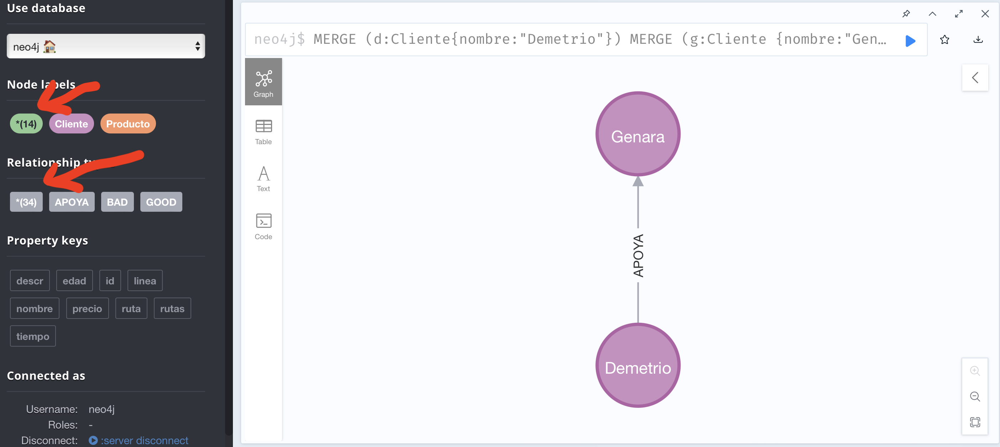

Existe otra forma de llegar al mismo resultado pero ya no sería una única consulta. Habría que crear una restricción
de unicidad para la propiedad `nombre` en los nodos de tipo `Cliente`, evitando los duplicados de los nodos, y luego ejecutar el `MERGE` para la relación y así
evitar el duplicar la relación en sí.

```cypher
CREATE CONSTRAINT FOR (c:Cliente) REQUIRE c.nombre IS UNIQUE;

MERGE (d:Cliente{nombre:"Demetrio"})-[:APOYA]->(g:Cliente{nombre:"Genara"}) 
RETURN d,g
```

### 3. (5 puntos) Crea tu propia base de datos e implementa al menos 3 consultas sobre la misma.

He elegido implementar una base de datos que representa una versión reducida del **Metro de Madrid**,
para ello he creado los siguientes tipos de nodos:

* `Estacion`: representa las distintas estaciones de la red y cada nodo tiene una propiedad `nombre`
* `Linea`: representa el concepto usual de Línea de Metro y contiene las propiedades `id` con el identificador de la misma, 
`rutas` que es una lista con los identificadores que se van a utilizar en la relación `CONNECTS` para representar cada uno de los dos sentidos que tiene una linea

Hay una relación `CONNECTS` que representa un tramo entre dos estaciones, como las relaciones son siempre dirigidas en neo4j
tenemos que crear dos para cada par de estaciones conectadas, una en cada sentido, por cada linea que une ambas. Adicionalmente
la relación `CONNECTS` tiene las siguientes propiedades:

* `id`: identifica el tramo
* `ruta`: nos ayuda a identificar a qué línea y sentido pertenece este tramo
* `tiempo`: duración en minutos del viaje entre las dos estaciones, nótese que el mismo tramo puede tener duraciones distintas en cada sentido (por ejemplo cuando está en cuesta)

#### 3.1. Carga de datos

El fichero `bddd-metro-madrid.cyp` contiene todas las instrucciones para crear la base de datos. He escogido sólo las lineas 1, 2 y 3 del Metro de Madrid y de manera 
reducida: la 1 desde Cuatro Caminos hasta Antón Martín, la 2 desde Cuatro Caminos hasta Manuel Becerra y la 3 desde Moncloa hasta Legazpi.

La siguiente imagen muestra el grafo resultante de cargar dicho fichero en neo4j:

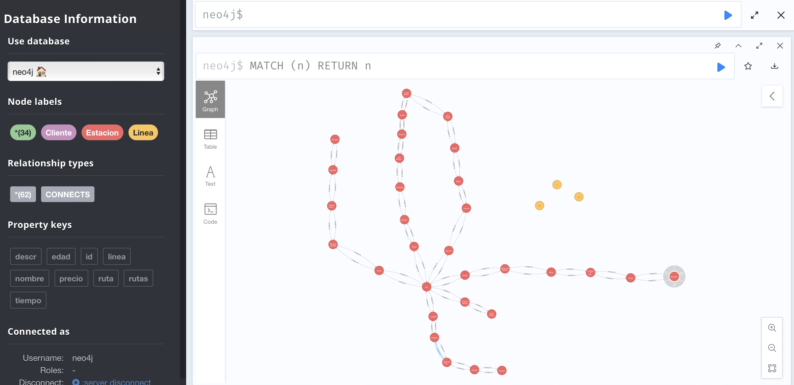

Las consultas se encuentra en el fichero `consultas-metro-madrid.cyp`

#### 3.2. Líneas que pasan por la estación de Sol

Esta consulta es muy sencilla:

```cypher
MATCH (l:Linea), (:Estacion {nombre:'Sol'})-[c:CONNECTS]-() 
  WHERE c.ruta IN l.rutas 
RETURN distinct(l.id) AS `Lineas que pasan por Sol`
```
El resultado se muestra en la imagen a continuación:

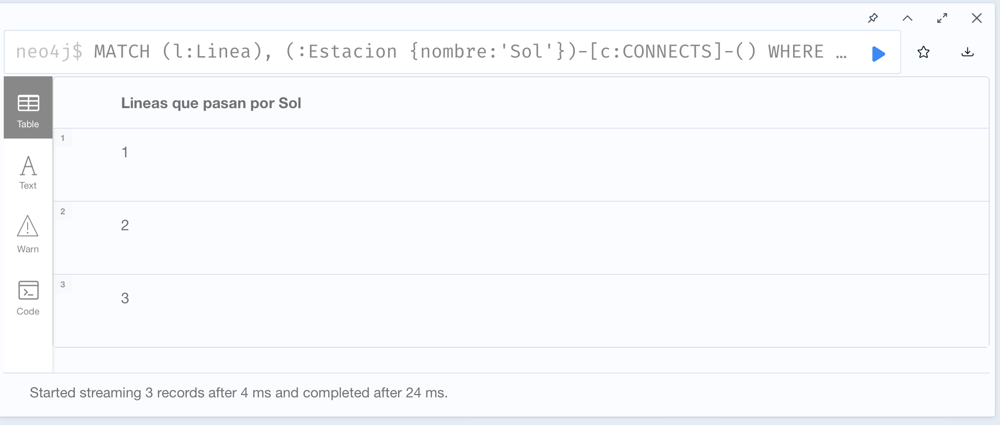

#### 3.3. Búsqueda del trayecto más corto entre dos estaciones por número de tramos

Vamos a buscar el camino más corto, por número de estaciones o tramos, entre las estaciones de Queveo y Goya. Nótese
que utilizamos las siguientes funciones:

* `shortestPath`: función de la librería estándar que nos ayuda a encontrar el recorrido mínimo
* `relationships`: dado un camino (*path*) nos devuelve sus relaciones
* `startNode`: dada una relación nos da el nodo desde el que parte
* `endNode`: dada una relación nos da el nodo en el que termina

Primero encontramos el camino mínimo y el resultado lo pasamos como entrada a otra consulta, y lo primero que hacemos ésta 
es obtener las relaciones, que se devuelven como una lista, hacemos un `UNWIND` para convertir dicha lista en un tabla
de relaciones y ya podemos aplicar una cláusula `MATCH` para obtener las líneas que vamos utilizando y demás datos:

```cypher
MATCH
  (Quevedo:Estacion {nombre: 'Quevedo'}),
  (Legazpi:Estacion {nombre: 'Legazpi'}),
  camino =shortestPath((Quevedo)-[:CONNECTS*]->(Legazpi))
WITH camino
UNWIND relationships(camino) as tramo
MATCH (l:Linea)
  WHERE tramo.ruta IN l.rutas
RETURN l.id AS Linea, 
       startNode(tramo).nombre AS `Comienzo de tramo`, 
       endNode(tramo).nombre AS `Final de tramo`, 
       tramo.tiempo+' minutos' AS `Duración del tramo`
```

El resultado es, como era de espera, utilizar la línea 2 hasta Sol y cambiar a la línea 3 hasta Legazpi:

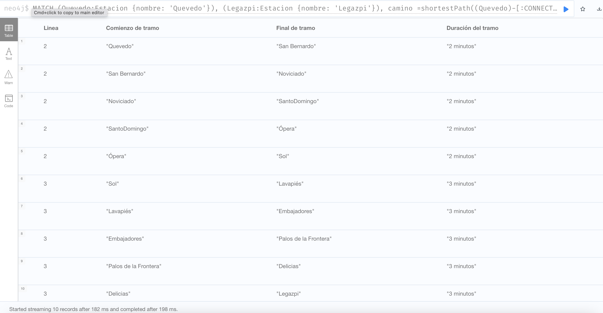

#### 3.4. Duración del trayecto anterior

Para comparar con las siguiente consulta, recorrido más corto por tiempo, vamos a consultar el tiempo que se tarda siguiendo
el recorrido anterior y para ello vamos a utilizar la función `reduce` sobre una lista para ir calculando la suma total de tiempos:

```cypher
MATCH
  (Quevedo:Estacion {nombre: 'Quevedo'}),
  (Legazpi:Estacion {nombre: 'Legazpi'}),
  camino =shortestPath((Quevedo)-[:CONNECTS*]->(Legazpi))
RETURN 
  reduce(duracion = 0, r IN relationships(camino) | duracion + r.tiempo)
  AS `Duración del trayecto más corto, por nº de tramos, entre Quevedo y Legazpi`

```

El resultado es de 25 minutos:

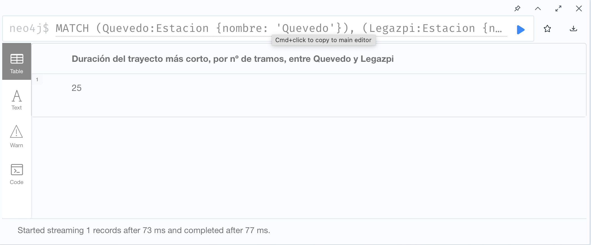

#### 3.5. Búsqueda del trayecto más corto entre dos estaciones por tiempo

Aquí no utilizamos la función `shortestPath` sino que buscamos todos los caminos entre ambas estaciones y después
calculamos sus duraciones totales, como hemos hecho anteriormente pero dentro de una cláusula `WITH` para utilizar
su resultado para ordenar todos los posibles caminos por duración calculada y quedarnos con el primero.

```cypher
MATCH (Quevedo:Estacion {nombre: 'Quevedo'}),
      (Legazpi:Estacion {nombre: 'Legazpi'}),
      camino = (Quevedo)-[:CONNECTS*]->(Legazpi)
WITH reduce(duracion = 0, r IN relationships(camino) | duracion + r.tiempo) 
     AS duracion, camino
ORDER BY duracion LIMIT 1
WITH camino
UNWIND relationships(camino) as tramo
MATCH (l:Linea)
  WHERE tramo.ruta IN l.rutas
RETURN l.id AS Linea, 
       startNode(tramo).nombre AS `Comienzo de tramo`, 
       endNode(tramo).nombre AS `Final de tramo`, 
       tramo.tiempo+' minutos' AS `Duración del tramo`

```

Resulta que el recorrido más corto en tiempo resulta ser ir hacia atrás, hasta Cuatro Caminos por la línea 2, coger la 
línea 1 hasta Sol y allí cambiar a la 3 hasta Legazpi. Evidentemente este resultado no tiene porque corresponderse con 
la realidad física ya que he preparado los datos de tiempos de cada trayecto buscando este resultado.

Es importante notar que esta consulta tarda 13'664 segundos frente a los 198 milisegundos de la que utiliza la función 
`shortestPath` debido a que ésta última función está optimizada.

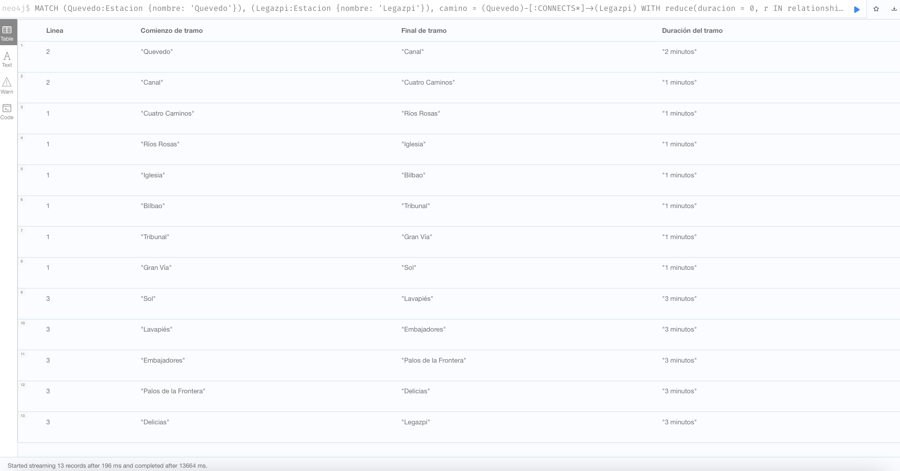

#### 3.6. Duración del trayecto más corto por tiempo

Este cálculo es algo más simple ya que no utilizamos `shortestPath` para a cambio el coste computacional es mayor.

```cypher
MATCH (Quevedo:Estacion {nombre: 'Quevedo'}),
      (Legazpi:Estacion {nombre: 'Legazpi'}),
      camino = (Quevedo)-[:CONNECTS*]->(Legazpi)
WITH reduce(duracion = 0, r IN relationships(camino) | duracion + r.tiempo) 
     AS duracion, camino
  ORDER BY duracion LIMIT 1
RETURN duracion 
       AS `Duración del trayecto más corto, por tiempo, entre Quevedo y Legazpi`
```

El resultado, como ya vimos en el apartado anterior es de 24 minutos:

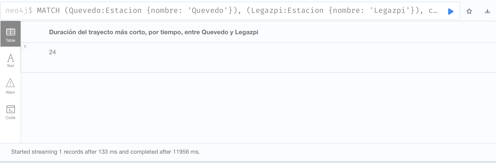

### 4. Conclusiones finales

Este trabajo me ha parecido muy interesante porque me ha permitido familiarizarme de modo práctico con las bases de datos
de grafos que hace tiempo que me interesan de manera profesional. En el pasado tuve que implementar un producto de gestión 
de flotas de autobuses urbanos y mi equipo y yo diseñamos, como parte del mismo un micro-servicio que contenía la topología
de la red y lo hicimos haciendo uso de una base de datos relacional geo-referenciada. Ni que decir tiene que fue muy complicado
y que pronto nos dimos cuenta de sus limitaciones para el problema al que nos enfrentábamos. Tiempo después, leyendo en la literatura, concretamente
el "Designing Data Intensive Applications" de Kleppman me di cuenta de que una base de datos de grafos hubiera sido la solución
idónea.

Es por lo anterior que para este trabajo he elegido como ejemplo una red de transporte urbano, aunque no fuera de autobuses, ya que una red
de autobuses tiene otras complicaciones, principalmente un callejero, que hubiera hecho el ejemplo demasiado complejo para este
trabajo. En cualquier caso me ha servido para probar lo suficiente como para ver la utilidad de estas bases de datos en situaciones
en las que hay relaciones circulares, búsquedas de caminos, etc.

En cuanto a los puntos fuertes y débiles he de decir que no he tenido tiempo para mejorar las dos últimas consultas para hacerlas
más óptimas, los tiempos de respuesta son muy elevados y estoy seguro de que hay una solución mejor ya que esta base de datos está
especialmente diseñada para este tipo de búsquedas con costes asociados a los arcos, seguramente existen funciones en la librería que
optimizan este tipo de búsqueda.

En el futuro me gustaría estudiar las posibilidades que hay dentro de neo4j de añadir geo-referencias en los nodos para poder
realizar búsquedas de caminos por adyacencias que era una de los problemas con que nos enfrentamos en la situación que comenté
anteriormente. Estoy seguro de que esto es posible sino en neo4j en alguna implementación de bases de datos de grafos.
